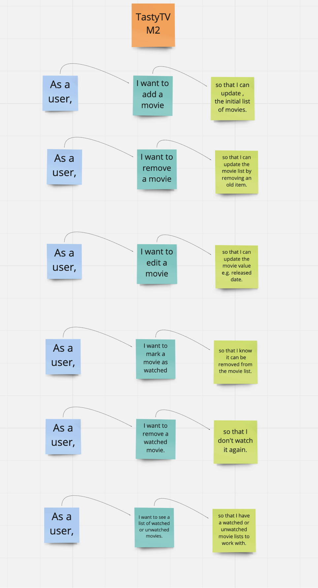
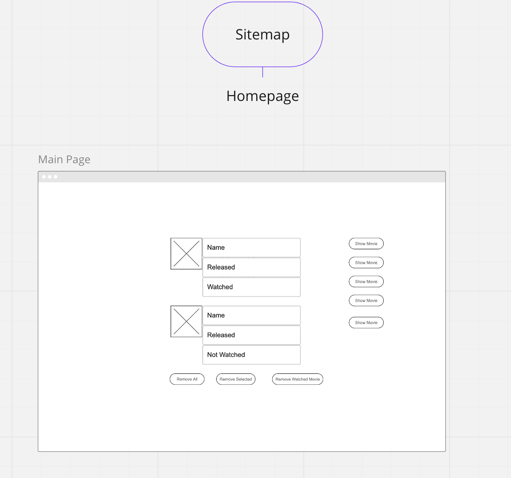

# Project - TastyTV

> TastyTV is a movie and tv show live-streaming service. Whom require a promotional website to pubicisize the company and its offerings.They want to Launch a SPA (Single page application) that allows its visitors to maintain and watch movies later.
> Live demo [_here_](https://github.com/aerotron1/TastyTV-M2.git).

## Table of Contents

- [General Info](#general-information)
- [Screenshots] (#screenshots)
- [Technologies Used](#technologies-used)
- [Features](#features)
- [Setup](#setup)
- [PlanningStage](#planning-stage)
- [DevelopmentStage](#Development-stage)
- [Usage](#usage)
- [Project Status](#project-status)
- [Room for Improvement](#room-for-improvement)
- [Unsolved](#unsolved-problems)
- [Acknowledgements](#acknowledgements)
- [Contact](#contact)

## General Information

# Introduction

> Project includes a SPA that will help people add, remove movies from watched later list. They should also be able to mark an item as watched. In order to get started the data was fetched from TastyTV API. I have created this to learn reactjs and put into practice what was learnt in class.

# Project purpose

Requrements see below:-

- Display the list of movies fetched from the API.
- Special feature, when clicked on the movie button, It should display the name of the movie. A form to include user input in order to add and store a movie. In addition allow the user to mark it as watched and remove it.

- Wireframes and User Stories see below
- Used wireframes and user stories to get started, from which I had to deviate from the original design.
  > [_here_](https://miro.com/app/board/o9J_lqaMUxY=/.)

## Screenshots

## Technologies Used

- HTML - version: 5.0
- CSS - version: 3.0
- JavaScript: version ES6
- Reactjs: version 17.0.2

## Features

List the ready features here:

- View a variety of movies when refreshed. Once clicked view movie information.
- When you add a new movie, you should mark it as watched where the text turns green.
- Remove all and individual movies.

## Setup

# Location

> HTTPS link [_here_](https://github.com/aerotron1/TastyTV-M2.git).
> GitHub link [_here_](git@github.com:aerotron1/TastyTV-M2.git).

# Setup & Installation

- Installed react app package via terminal :-
  -- Ensured in the correct directory > npx create-react-app tastytv > npm start
  This automatically launched the browser with react logo.
- Created a GitHub repository :-
  -- git init > git add . > git commit -m "first commit" > git remote add origin > git push -u origin main.
  This succesfully created the repository to push frequent commits.

## Planning Stage

- With reference to the client brief, a wireframe and user story was created to ensure I have a plan to work with.
- I looked at class tutorials to get started and learnt react.
- During development stage, I created a retrospective after each day to know what I have acheived and what to work on next. It includes any blockers I came across.
- Sitmap starts with the Homepage.

## Development Stage

29/11/21

1. What have you done so far
   - I created a user story and wireframe based on the client brief
   - Created react app package and removed unnecessary files/imports.
   - Defined components.
   - Implementing the static UI to show content.
2. What are you going to work on next

   - static UI to show content

3. What blockers you have (if any)
   - Errors with import export and defining components.

30/11/21

1. What have you done so far
   - Implemented static UI, props and state.
   - Fetched data from client API
   - Debugged errors with map()
2. What are you going to work on next

   - Get buttons to add and show watched movie in a different colour.
   - Create repository and Push commit
   - Update README file

3. What blockers you have (if any)
   - Map() due not defining component and improper use of props.

01/12/21

1. What have you done so far
   - Implemented static UI, props and state.
   - Fetched data from client API
   - Debugged errors with map()
   - Get buttons to add and store movies.
   - Click watched movie to highlight a movie in a different colour.
2. What are you going to work on next
   - Remove all movies and remove filtered movie.
   - Fix bug with the input field movie release date.
   - Update README file and improve code quality. Delete files not in use and commented code.
3. What blockers you have (if any)
   - Add Movie button does not render correctly when the state changes.
   - Map() due not defining component and improper use of props.
   - Import/Export with AddMovies and AddMovieList
   - AddMovieList component add={add} had a spelling mistake when using props.
   - Failed to compile - Index not defined. - moved key and remove space from h2 tag.

03/12/21

1. What have you done so far

- Remove movie

2. What are you going to work on next
   - Complete check for functionality.
   - Edit an item(movie)
   - Add CSS using react components.
   - Local storage to save the movie information in the browser.
   - Update README file and improve code quality.
3. What blockers you have (if any)
   - Add Movie button does not render correctly when the state changes. Bug with input release date - unable to render in similar format to client Array (Movie.js).
   - After a new movie is entered, it duplicates as an output.
   - watchedMovie does not change colour individually.

## Usage

How does one go about using it?

- Once the app is launched, you can start by clicking the movies. This should show the movie information such as name, released and image.
- You can click removed all movie which removes the movie information.
- If you need to add a new movie, enter the information in the input fields provided and click Add Movie.
- If watched, click watched which higlights the movie in green.
  `{{color: props.add.watched ? "green" : "red"}}`
- Remove all movie `<button onClick={() => setMovieValue("")}>Remove movies added</button>`
  Remove a movie `<button onClick={() => props.removeMovie(props.add)}>Remove</button>`

- Tested on web browsers such as Chrome, Brave, Firefox etc.

## Project Status

Project is: _in progress_

## Room for Improvement

To do:

- Edit an Item.
- Create Watch later list.
- Apply watched feature to client API.
- Save list data.
- Use 3rd party API.
- Create style with CSS using react component library.
- Allow users to sign up & in using firebase.

## Unsolved problems

- Add Movie button does not render correctly when the state changes. It does not include release date and image. Bug with input release date - unable to render in similar format to client Array (Movie.js).
- watchedMovie does not change colour individually when clicked on the watched button.

## Acknowledgements

Give credit here.

- This project was inspired by class tutorials.
- [UseEffect](https://github.com/SkillsUnion-SE-C3/react-useeffect.git).
- [Stateprops&unidirectionalflow](https://github.com/SkillsUnion-SE-C3/unidirectional-flow-session.git)
- [Statetopropsexcercises](https://github.com/SkillsUnion-SE-C3/react-exercises.git)

- Other resources used for the project include : -
- [README](https://github.com/ritaly/README-cheatsheet).
- [Freecodecamp](https://www.freecodecamp.org/)
- [W3schools](https://www.w3schools.com/).
- [MDN](https://developer.mozilla.org/en-US/).

## Contact

Created by [Stanton] - If any questions, feel free to contact me.
